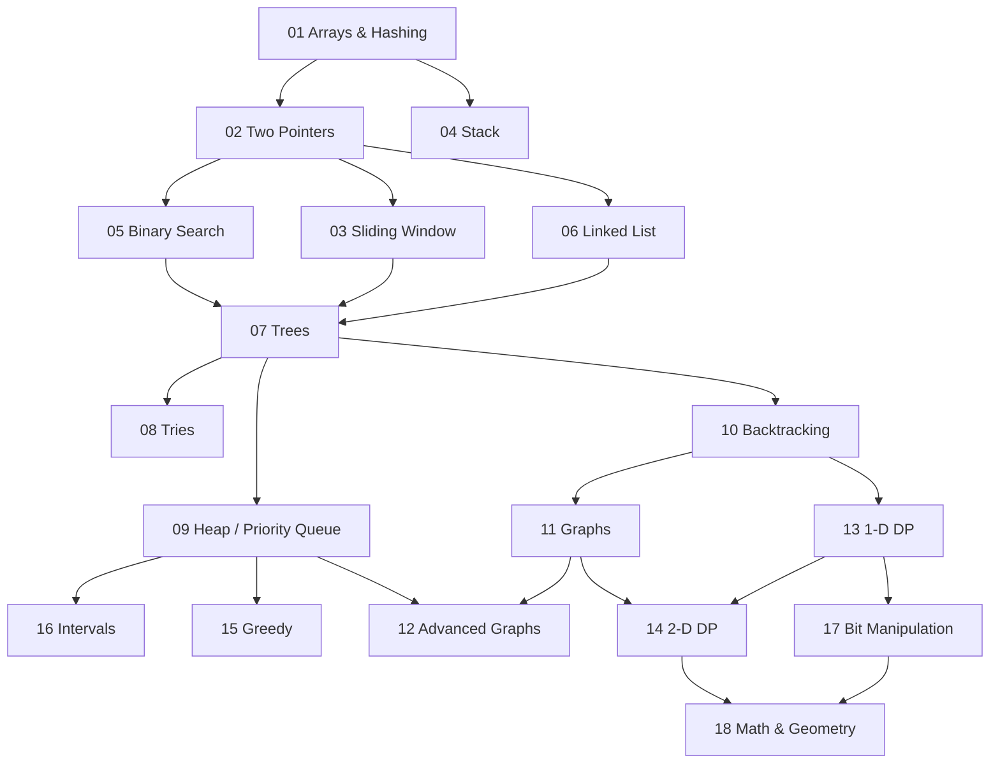

# DSA

My practice repo for data structures, algorithms, and coding interviews.
Python 3, organized by **pattern** — not by problem number — and working
through the **[Blind 75](PROBLEMS.md)**.

Built so that coming back after months away takes an hour, not a month.
[Why that matters →](START_HERE.md)

---

## 👉 Where to start

| I want to... | Go here |
|---|---|
| 🧭 **See every pattern + template** | **[cheatsheets/_patterns.md](cheatsheets/_patterns.md)** ← start here if you're just visiting |
| 🐍 **Look up a Python idiom** | [cheatsheets/_python.md](cheatsheets/_python.md) |
| 🔄 Come back after a long gap | [START_HERE.md](START_HERE.md) |
| 📚 Learn a topic properly | [notes/](notes/) → then [problems/](problems/) |
| ⚡ Cram before an interview | [cheatsheets/](cheatsheets/) |
| ✅ **Work the Blind 75** | [PROBLEMS.md](PROBLEMS.md) |
| 📊 See where I'm at | [PROGRESS.md](PROGRESS.md) |

---

## Run it

```bash
git clone https://github.com/dymasius12/DSA.git
cd DSA && pip install pytest
./review          # tells me what to work on today
```

| Command | What it does |
|---|---|
| `./check` | run all tests |
| `./check 01` | run one module |
| `./review` | what's decayed? what should I do today? |
| `./log "did two_sum" 45` | record a session |

---

## Repo map

```
cheatsheets/   one screen per topic — for reloading fast
notes/         the full explanation — for learning it the first time
problems/      stubs I fill in — the reps
solutions/     annotated references — read AFTER trying
tests/         pytest; fails until the stub is implemented

PROBLEMS.md    the Blind 75 checklist, mapped to these modules
```

Same topic, three depths. Read across them depending on how much time I have.

---

## The problem list: Blind 75

The [Blind 75](PROBLEMS.md) is the best-known curated list of interview
problems: 75 of them, chosen to cover every core pattern with little overlap.
It's the problem set this repo works through.

| | Easy | Medium | Hard | Total |
|---|---|---|---|---|
| **Blind 75** | 20 | 48 | 7 | **75** |
| **Built here so far** | 3 | 5 | 0 | **8** |

The full checklist, grouped by module: **[PROBLEMS.md](PROBLEMS.md)**.
Once it's done, the next step is the **NeetCode 150**. It covers the same 18
topics and adds 75 more problems to smooth the jumps in difficulty.

---

## Roadmap

The order isn't arbitrary — topics unlock each other. This is the NeetCode
dependency graph:



Two things that graph tells you that a flat list doesn't:

- **Arrays & Hashing is the root.** Everything downstream assumes it. Skipping
  it to get to the "interesting" topics is why people stall later.
- **Trees is the choke point.** Tries, Heap, and Backtracking all wait behind
  it — and Backtracking is what opens Graphs and DP. It's the single highest-
  leverage module in the middle of the map.

**Built:** `00` Foundations · `01` Arrays & Hashing ·
**Next:** `02` Two Pointers

Modules get built as I reach them. A wall of 300 unfinished stubs is exactly
what makes coming back feel heavy.

<details>
<summary><b>Full roadmap with one-line descriptions</b></summary>

<br>

| # | Module | The pattern, in one line | Blind 75 | Status |
|---|--------|--------------------------|----------|--------|
| 00 | Foundations | Big-O, and the Python toolkit you need | — | ✅ |
| 01 | Arrays & Hashing | Trade memory for time with a dict or set | 8 | ✅ |
| 02 | Two Pointers | Two indices walking a sorted array | 3 | |
| 03 | Sliding Window | A contiguous range that grows and shrinks | 4 | |
| 04 | Stack | Last in, first out — "match the previous thing" | 1 | |
| 05 | Binary Search | Halve the search space every step | 2 | |
| 06 | Linked List | Pointer surgery; fast and slow pointers | 6 | |
| 07 | Trees | Recursion on two children | 11 | |
| 08 | Tries | A tree keyed by characters | 3 | |
| 09 | Heap | Always pull the smallest or largest next | 1 | |
| 10 | Backtracking | Try, recurse, undo | 2 | |
| 11 | Graphs | Grids and adjacency lists; BFS and DFS | 6 | |
| 12 | Advanced Graphs | Dijkstra, topological sort, union-find | 1 | |
| 13 | 1-D DP | Cache the answer to a smaller version | 10 | |
| 14 | 2-D DP | Cache over a grid of subproblems | 2 | |
| 15 | Greedy | Take the locally best choice — and prove it | 2 | |
| 16 | Intervals | Sort by start, then merge or count | 5 | |
| 17 | Bit Manipulation | XOR, masks, and counting bits | 5 | |
| 18 | Math & Geometry | Index arithmetic on a matrix — rotate, spiral, in-place | 3 | |

</details>

---

<details>
<summary><b>Why this repo is built this way</b></summary>

<br>

I've learned this material before. More than once.

Then life gets busy, I stop for a few months, and coming back feels like
starting from zero. *That feeling* is the real problem — it's what makes me not
open it at all. The knowledge decaying is annoying. Dreading the restart is
what costs me the years.

DSA evaporates because most people store it as **thousands of loose problems**.
Loose things decay. Patterns compress, and compressed things reload fast.

So every module leaves three artifacts, in order of how fast they rot:

| Artifact | Decays |
|---|---|
| `problems/` — the reps | **fast** |
| `notes/` — the explanation | slowly |
| `cheatsheets/` — one screen | **barely** |

Coming back means reloading the smallest, most durable one and letting the rest
decompress behind it. Then `./review` scores every topic by decay (time away ×
how shaky I was) and just tells me where to start — removing that decision is
most of the battle.

</details>

<details>
<summary><b>How I work through a module</b></summary>

<br>

1. Read `notes/NN_*.md` — the pattern, when it applies, the template.
2. Fill in the stubs in `problems/mNN_*/`.
3. `./check NN` until green.
4. *Then* read `solutions/mNN_*/` and compare approaches.
5. Write the cheatsheet **in my own words**, then `./log` it.

**Pacing:** one module a week. Notes Monday, problems Tuesday–Friday.
Saturday is review day — re-solve three problems from *earlier* modules from a
blank file, no notes. Everyone skips this. It's the part that makes it stick.

**Rules I keep breaking and shouldn't:**

1. **Type the solution, never paste it.** Muscle memory is real.
2. **Say the complexity out loud before writing code.** Time and space.
3. **Never more than 25 minutes stuck.** Read the solution, close it, rewrite it
   from memory tomorrow. That's the method, not cheating.
4. **A solution I read is not a solution I know.** Re-solve it two days later.
5. If I can't explain the approach in two sentences, I don't understand it yet.

</details>

<details>
<summary><b>If you're not me</b></summary>

<br>

You're welcome to any of it. A few honest notes:

- The **[pattern map](cheatsheets/_patterns.md)** is the part most likely to be
  useful standalone — a trigger → pattern table plus working templates for all
  16 patterns, assuming nothing about the rest of the repo.
- The notes teach rather than show off. Starting near zero?
  [`notes/00_foundations.md`](notes/00_foundations.md) assumes nothing.
- `PROGRESS.md` is my tracker. Fork it and it's yours — but the confidence
  scores only work if you're honest, and honest is uncomfortable.
- Problem statements are paraphrased in the docstrings so the repo stands
  alone; LC numbers are there if you want the original.

If something's wrong or badly explained, an issue is welcome.

</details>
