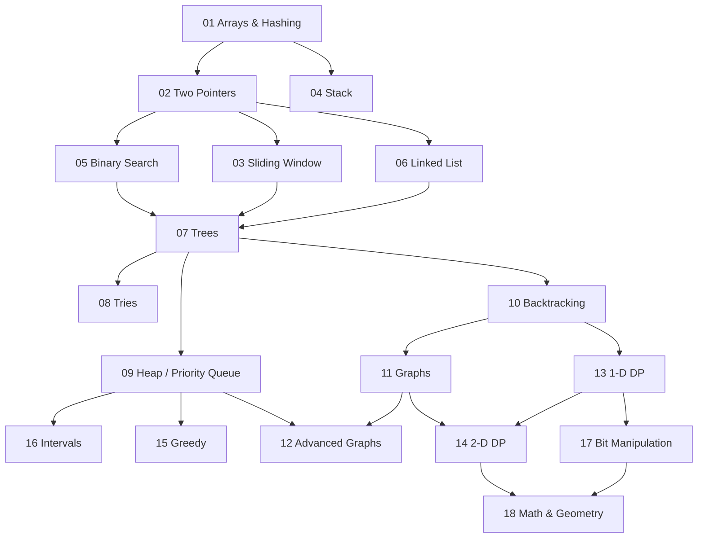

# Roadmap

18 modules, one pattern each, plus a foundations module. The order isn't
arbitrary: topics unlock each other.

## What unlocks what

This is the NeetCode dependency graph:

Two things the graph shows that a flat list doesn't:

- **Arrays & Hashing is the root.** Everything below assumes it. Skipping it to
  reach the "interesting" topics is why people stall later.
- **Trees is the bottleneck.** Tries, Heap, and Backtracking all sit behind it,
  and Backtracking is what opens Graphs and DP. It's the highest-leverage
  module in the middle of the map.

## Modules

<!-- modules:start -->
<!-- Generated by ./sync. Edit tools/catalog.py or the solution files instead. -->

| # | Module | The pattern, in one line | Blind 75 solved | In this repo |
|---|---|---|--:|---|
| 00 | Foundations | Big-O, and the Python toolkit you need | — | [notes](notes/00_foundations.md) · [cheatsheet](cheatsheets/00_complexity.md) · [practice](problems/m00_foundations/) |
| 01 | Arrays & Hashing | Trade memory for time with a dict or set | 2 / 8 | [notes](notes/01_arrays_hashing.md) · [cheatsheet](cheatsheets/01_arrays_hashing.md) · [practice](problems/m01_arrays_hashing/) · [2 write-ups](leetcode/01_arrays_hashing/) |
| 02 | Two Pointers | Two indices walking toward each other | 1 / 3 |  |
| 03 | Sliding Window | A contiguous range that grows and shrinks | 1 / 4 | [2 write-ups](leetcode/03_sliding_window/) |
| 04 | Stack | Last in, first out: match the previous thing | 0 / 1 |  |
| 05 | Binary Search | Halve the search space every step | 0 / 2 |  |
| 06 | Linked List | Pointer surgery; fast and slow pointers | 2 / 6 | [2 write-ups](leetcode/06_linked_list/) |
| 07 | Trees | Recursion on two children | 1 / 11 | [1 write-up](leetcode/07_trees/) |
| 08 | Tries | A tree keyed by characters | 0 / 3 |  |
| 09 | Heap / Priority Queue | Always pull the smallest or largest next | 0 / 1 |  |
| 10 | Backtracking | Try, recurse, undo | 0 / 2 |  |
| 11 | Graphs | Grids and adjacency lists; BFS and DFS | 0 / 6 |  |
| 12 | Advanced Graphs | Dijkstra, topological sort, union-find | 0 / 1 |  |
| 13 | 1-D Dynamic Programming | Cache the answer to a smaller version | 0 / 10 |  |
| 14 | 2-D Dynamic Programming | Cache over a grid of subproblems | 0 / 2 |  |
| 15 | Greedy | Take the locally best choice, and prove it | 0 / 2 | [1 write-up](leetcode/15_greedy/) |
| 16 | Intervals | Sort by start, then merge or count | 0 / 5 |  |
| 17 | Bit Manipulation | XOR, masks, and counting bits | 1 / 5 | [1 write-up](leetcode/17_bit_manipulation/) |
| 18 | Math & Geometry | Index arithmetic on a matrix: rotate, spiral, in place | 0 / 3 |  |
<!-- modules:end -->

Modules get their notes, cheatsheet, and practice stubs as they're reached,
rather than all at once. A wall of empty stubs is exactly what makes coming
back feel heavy.

## How to work through a module

1. **Learn:** read `notes/NN_*.md`: the pattern, when it applies, the template.
2. **Practise:** fill in the stubs in `problems/mNN_*/`, and run `./check NN`
   until it's green.
3. **Compare:** only then read `solutions/mNN_*/`.
4. **Apply:** solve the module's Blind 75 problems on LeetCode
   ([PROBLEMS.md](PROBLEMS.md)), and write them up in `leetcode/` with
   [the template](templates/leetcode_solution.py).
5. **Compress:** write `cheatsheets/NN_*.md` **in your own words**
   ([template](templates/cheatsheet.md)), then `./log` the session.

**Pacing:** about one module a week. Keep one day for review: re-solve three
problems from *earlier* modules from a blank file, with no notes. It's the
step everyone skips, and it's the one that makes the rest stick.

**Rules worth keeping:**

1. **Type solutions, never paste them.** Muscle memory is real.
2. **Say the complexity out loud before writing code:** time and space.
3. **Never more than 25 minutes stuck.** Read the solution, close it, and
   rewrite it from memory the next day. That's the method, not cheating.
4. **A solution you've read isn't a solution you know.** Re-solve it two days
   later.
5. **If you can't explain the approach in two sentences,** you don't
   understand it yet.

[← back to the repo](README.md)
